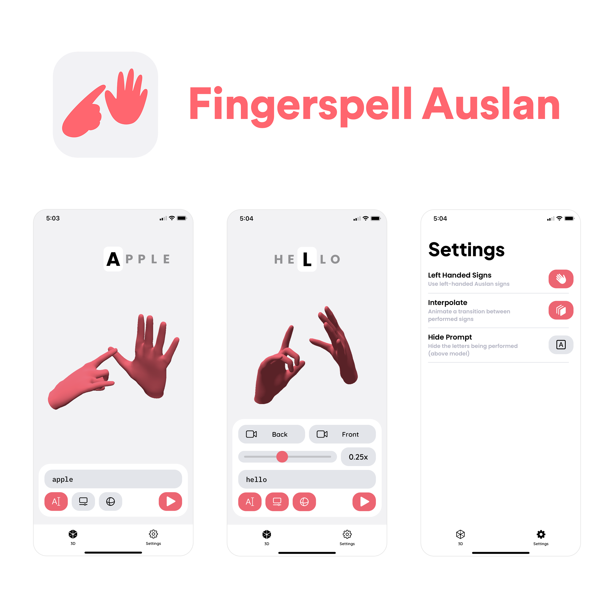

An Auslan (Australian sign language) fingerspelling app for iOS.

* Enter a prompt to be converted to an animated, interactive, 3D model performing the prompt in Auslan fingerspelling
* Has a toolbar to control the scene
    * Prompt input to enter any alphabetical character sequence
    * Scrubber to see and control the animation's progression
    * Playback speed control to change the animation playback speed
    * Buttons to reset the camera to the default front/back perspectives
* Has settings to use left handed models, disable interpolation, and hide the display prompt

