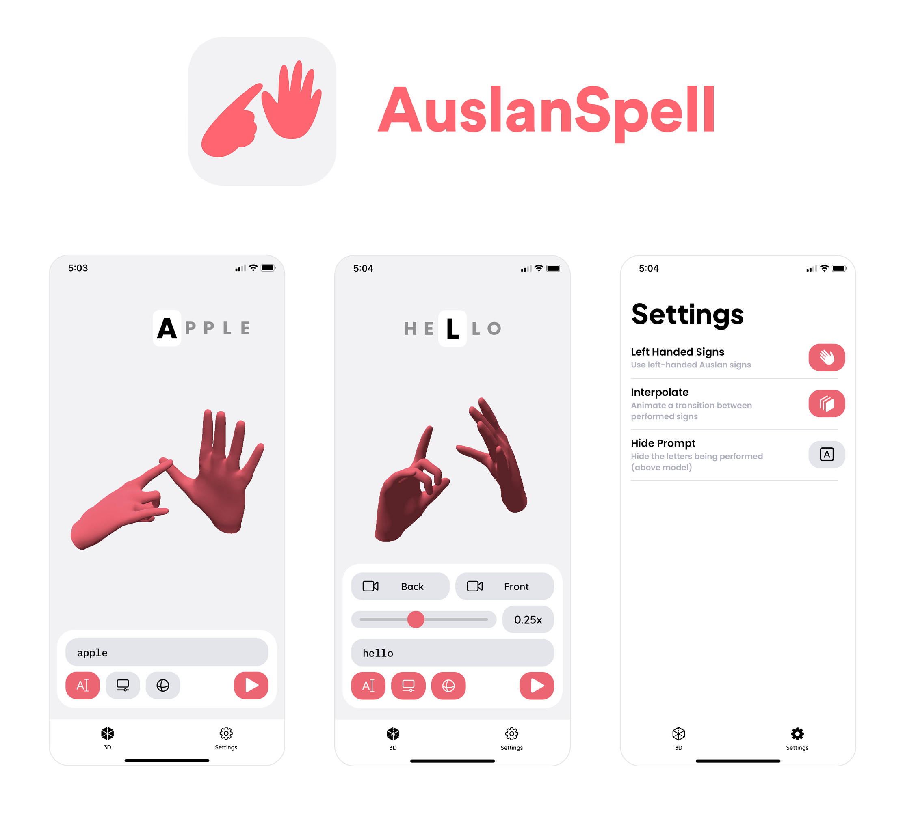

## About

An Auslan (Australian sign language) fingerspelling app for iOS.

* Enter a prompt to be converted to an animated, interactive, 3D model performing the prompt in Auslan fingerspelling
* Control the animation with the toolbar
    * Prompt input to enter any alphabetical character sequence
    * Scrubber to see and control the animation's progression
    * Playback speed control to change the animation playback speed
    * Buttons to reset the camera to the default front/back perspectives
* Has settings to use left handed models, disable smooth transitions, and hide the display prompt
* Try out the experimental recognition feature - the app will prompt a letter and recognise when it's performed using the device's camera

## Demos

Main Demo: [YOUTUBE LINK](https://youtube.com/watch?v=BS5IwGK1_Ls) *(Last updated: 1.1.0)*

Alphabet Demo: [YOUTUBE LINK](https://youtube.com/watch?v=8cXb0kTaQ-s) *(Last updated: 1.1.0)*

Recognition Demo: [YOUTUBE LINK](https://youtu.be/FaW3HjzHEoU) *(Last updated: 1.2.0)*

## Compatibility

* For iPhone, requires iOS 15.0 or later
* For iPad, requires iPadOS 15.0 or later
* For Mac, requires macOS 12.0 or later and a Mac with Apple M1 chip or later
* Supports both light mode and dark mode
* English only

