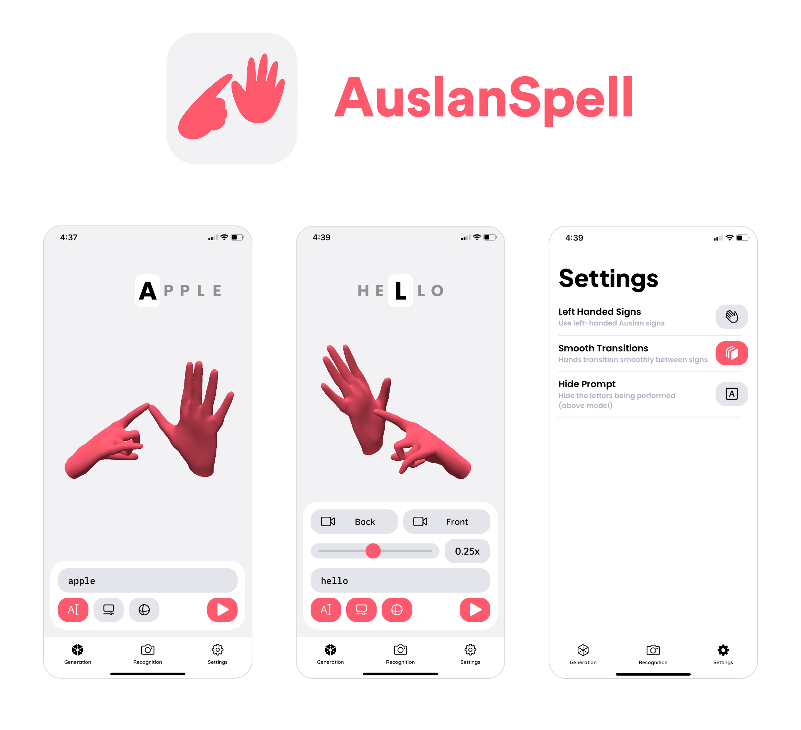

## Disclaimer

**This project has been moved to a private repo.**

As of 07/02/2024, this project was moved to a private repo to be continued being worked on by me (Andre Pham), as requested by the project's steering committee. The app is in beta testing and upon being released to the App Store, this page will be updated. Hence this repo acts as an archive of this project up to release 1.2.2.

There are significant changes being worked on for the full release - stay tuned!

--------

## About

An Auslan (Australian sign language) fingerspelling app for iOS.

* Enter a prompt to be converted to an animated, interactive, 3D model performing the prompt in Auslan fingerspelling
* Control the animation with the toolbar
    * Prompt input to enter any alphabetical character sequence
    * Pause/play button
    * Scrubber to see and control the animation's progression
    * Playback speed control to change the animation playback speed
    * Buttons to reset the camera to the default front/back perspectives
* Has settings to use left handed models, disable smooth transitions, and hide the display prompt
* Supports both light and dark mode - adapts to device preferences
* Try out the experimental recognition feature - the app will prompt a letter and recognise when it's performed using the device's camera

## Demos

Main Demo: [YOUTUBE LINK](https://www.youtube.com/watch?v=zVyGCPV9oeI)

Recognition Demo: [YOUTUBE LINK](https://www.youtube.com/watch?v=bfee_p-zAMA)

## Compatibility

* For iPhone, requires iOS 15.0 or later
* For iPad, requires iPadOS 15.0 or later
* For Mac, requires macOS 12.0 or later and a Mac with Apple M1 chip or later

## Release History

[CURRENT RELEASE](https://github.com/Andre-Pham/LimeApp/releases/latest)

Visit [here](https://github.com/Andre-Pham/LimeApp/releases) for all previous releases and changelogs.

